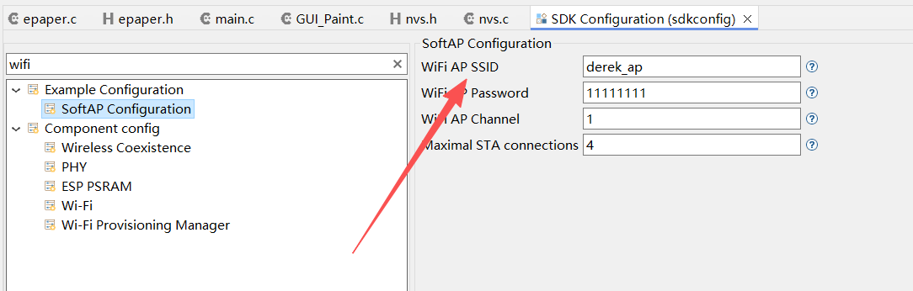
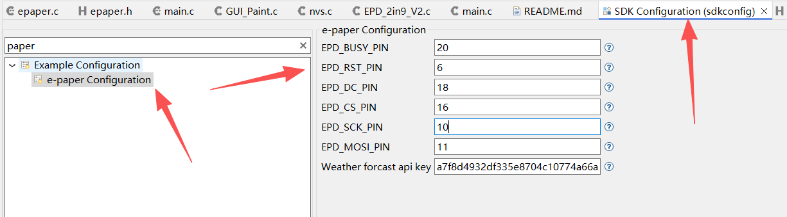
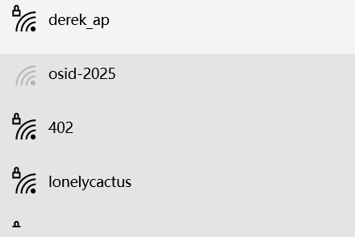
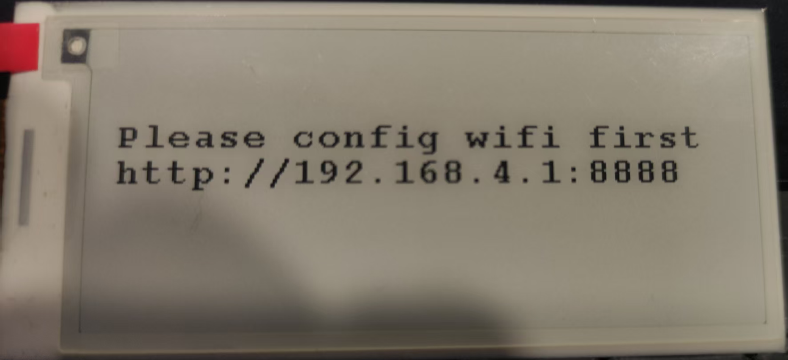
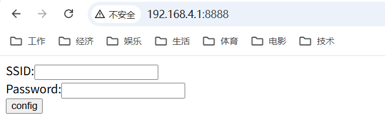
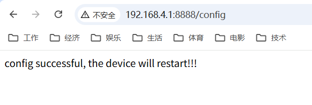
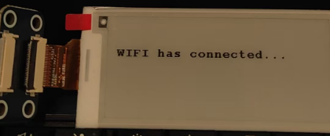
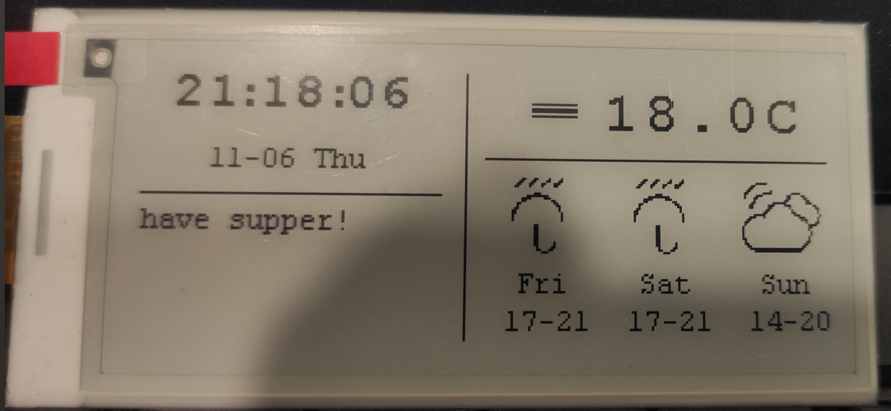
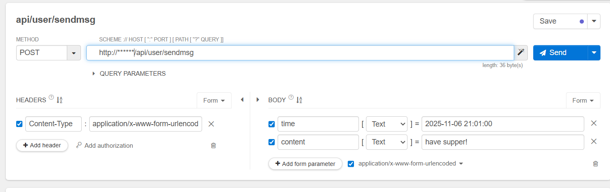

# esp32-idf-epaper-calendar

基于esp32(esp-idf)和微雪2.9寸墨水屏的一个日历实现


## 硬件

- Espressif ESP32-S3
- 微雪电子2.9寸墨水屏

## 软件
- ESP-IDF
- 微雪官方的墨水屏驱动，不过只支持esp32驱动只支持Arduino，参考我[另外一个项目](https://github.com/sunder3344/esp32-idf-epaper-embed)，把Arduino的代码集成到ESP-IDF里面

## video

[Click to watch ▶️](https://www.bilibili.com/video/BV1u12cBvEwN)


## 运行

- 用IDE打开项目里的`sdkconfig`文件，搜索`wifi`，然后按下图进行配置

<p align="center">

</p>

这里如果不修改，就是输入框中的默认设置，这里主要是配置AP热点的名称，密码。

----- 

- 用IDE打开项目里的`sdkconfig`文件，输入`paper`，然后按下图进行配置墨水屏和esp32的针脚

<p align="center">

</p>

根据你的实际情况来配置esp32和墨水屏的针脚，如果你不修改，那就按这个上面的序号来插你的杜邦线。

----- 

- 编译运行

<p align="center">

</p>

编译运行后，可以在电脑或者手机的WiFi管理里面找到之前配置的AP名称(这里我用的是`derek_ap`)

----- 

- 配网

<p align="center">

</p>

程序运行后，如果没有配网，那么会在墨水屏上提示配网(参见上图)，根据提示的链接去配网(这里我的配网地址是http://192.168.4.1:8888)

<p align="center">

</p>

输入你家里的WIFI名称(SSID)和密码，点提交就行了。

<p align="center">

</p>

提交后，显示配置成功，机器即将重启，等着就行了，esp32会自动重启。

<p align="center">

</p>

----- 

- 功能界面

重启后，就开始工作了（这里主要是显示当前日期、星期几、天气，未来3天的天气，日期等）

<p align="center">

</p>

----- 

- 消息提示

这里就做了一个简单的文字提示（局刷），我这里没有做app或者小程序，直接请求API来提交提示信息的，正规的做一个APP或者微信提示就很好

<p align="center">

</p>

##### *time* : 提醒的时间

##### *content* : 提醒的内容(这里没有用LVGL来画界面，所以不支持中文，只支持英文字符)

最后API接口就不提供了，按照下面的json，自己实现一个收发消息的API就可以了：

```
	{
	  status: "ok",
	  message: {
	    id: "a70371d0-b5f6-45ce-ba23-171a58e7e094",
	    time: "2025-11-06 21:01:00",
	    content: "have supper!"
	  }
	}
```
